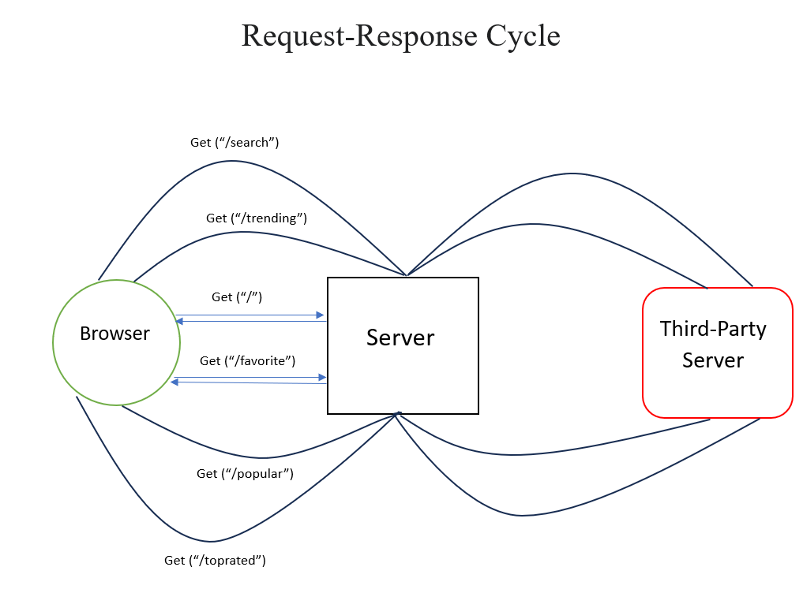

# Movies-Library
# Movies-Library - 1.0

**Author Name**: **Saif Yahya**

## WRRC

## Overview
**Movies library application is used for discovering the newest movies and let the user watching his favorite movies**

## Getting Started
**Steps to build this application:**
1. require the needed libraries.
2. require *data.json*  for the needed data.
3. let the server listenning for requests and determine port number.
4. using get request to build routes.
5. using axios get request for *API* request from *MDB*. 

## Project Features
- It uses dependencies: express, cors, dotenv, axios.
- It consists of 6 routes:
1. home page: it renders the movie data from *data.json* file
2. favorite page
3. trending page: it renders the  data using *API* from *MDB*
4. search page: it renders the  data using *API* from *MDB*
5. popular page: it renders the  data using *API* from *MDB*
6. toprated page: it renders the  data using *API* from *MDB*