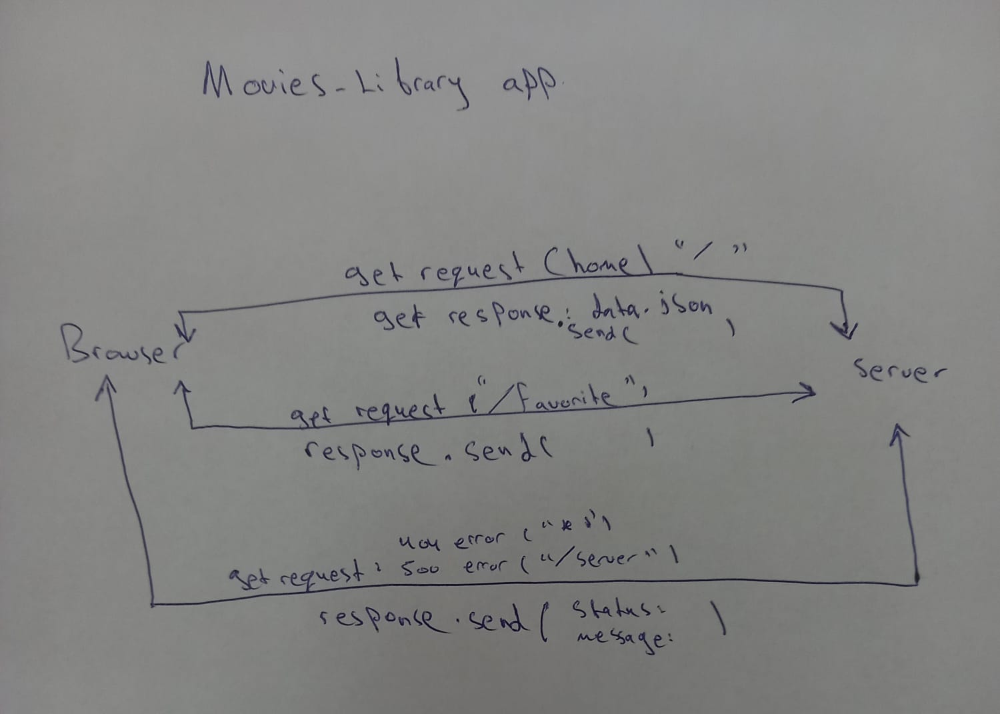

# Movies-Library
# Movies-Library - 1.0

**Author Name**: Saif Yahya

## WRRC

## Overview
Movies library application is used for discovering the newest movies and let the user watching his favorite movies

## Getting Started
steps to build this application:
1. require the needed libraries.
2. require any external needed data.
3. let the server listenning for requests and determine port number.
4. using get request to build routes.

## Project Features
It uses dependencies: express, cors.
It consists of 3 routes:
1. home page: it renders the movie data from json file
2. favorite page
3. routes for 404 error status and 500 error status