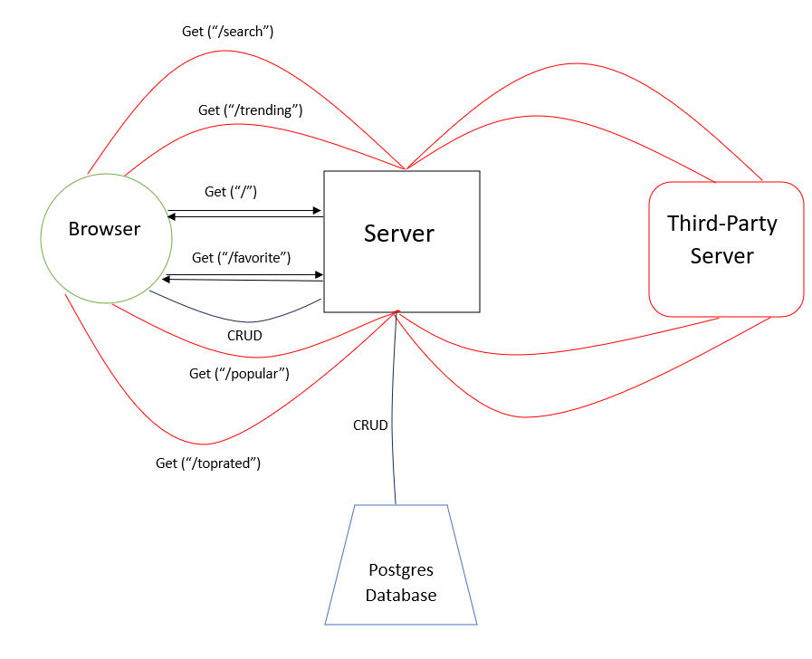

# Movies-Library
# Movies-Library - 1.0

**Author Name**: **Saif Yahya**

## WRRC

## Overview
**Movies library application is used for discovering the newest movies and let the user watching his favorite movies**

## Getting Started
**Steps to build this application:**
1. require the needed libraries.
2. require *data.json*  for the needed data.
3. let the server listenning for requests and determine port number.
4. using get request to build routes.
5. using axios get request for *API* request from *TMDB*. 
6. create your *Postgres* Database and table.
7. using *RESTful API* to access Database.

## Project Features
- Projesct uses dependencies: express, cors, dotenv, axios and pg.
- Projest has 2 main routes:
1. home page('/'): it renders the movie data from *data.json* file
2. favorite page('/favorite'): shows your favorite movies.

- Project has 4 routes for *TMDB API* requests:
1. trending page('/trending'): it renders the  data using *API* from *TMDB*
2. search page('/search'): it renders the  data using *API* from *TMDB*
3. popular page('/popular'): it renders the  data using *API* from *TMDB*
4. top rated page('/toprated'): it renders the  data using *API* from *TMDB*

- Project is connected to *Postgres* Database, using *RESTful API* to access Database:
1. **GET** all movies
2. **GET** movie by ID
3. **POST** a movie
4. **DELETE** a movie
5. **UPDATE** a movie
